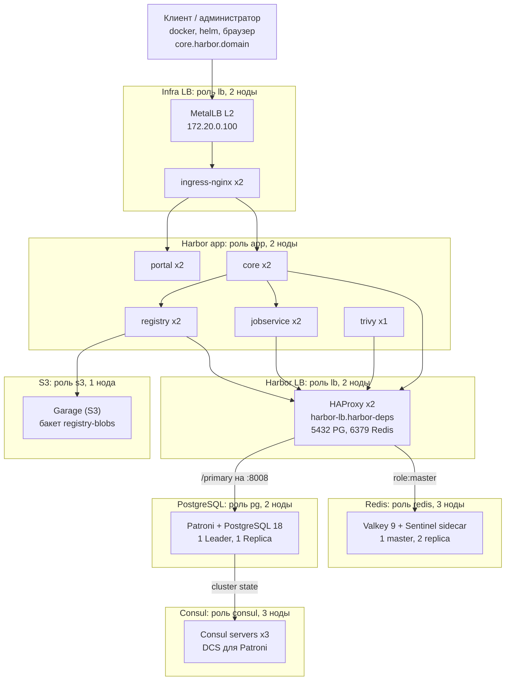

# Схема стенда: ноды, роли, адреса

> **P2 (2026-09-25):** Infra LB теперь Keepalived + HAProxy (`hack/ha/infra-lb.yaml`), MetalLB и ingress-nginx удалены, demo-приложение — NodePort `<IP control-plane>:30500`. Разделы ниже про MetalLB, ingress-nginx, `172.20.0.101` и анонс адреса устарели — переписываются в P6.


Справочник по устройству лабораторного стенда Harbor active-active на KinD: какая нода за что отвечает, что на ней работает, по каким адресам компоненты видят друг друга и где лежат данные. Снимок состояния: 2026-09-24 (после приёмки вехи 1).

Что стабильно, а что нет:

| Стабильно (задано в репозитории) | Меняется при каждой пересборке кластера |
|----------------------------------|-----------------------------------------|
| имена нод и их роли (порядок в `hack/config/kind-cluster.yaml`) | IP-адреса нод (выдаёт Docker) |
| DNS-имена сервисов, порты, namespace | IP подов и ClusterIP сервисов |
| IP балансировщиков: `172.20.0.100`, `172.20.0.101` (`Makefile`, пул MetalLB) | какой именно под роли стоит на какой ноде |
| подсети подов и сервисов | имена подов Deployment'ов (суффиксы) |

## Общая схема



Поток запроса `docker push`: клиент → `172.20.0.100` (MetalLB) → ingress-nginx → core (проверка токена) → registry → блобы в S3 (Garage); метаданные (проекты, артефакты, пользователи) — в PostgreSQL, кэш и очереди — в Redis. HAProxy направляет соединения к БД на текущий primary Patroni, соединения к Redis — на текущий master.

Бэкапы, Prometheus и Nexus с исходной схемы в лабораторию не входят (решения D8, D10 в `backlog.md`).

## Ноды

14 контейнеров Docker-сети `kind`: 1 control-plane и 13 воркеров. У каждого воркера метка и таинт `harbor-ha/role=<роль>` (`NoSchedule`): на роль попадают только поды с подходящим `nodeSelector` и toleration.

| Нода | Роль | IP (снимок) | Что на ней работает |
|------|------|-------------|---------------------|
| `harbor-control-plane` | control-plane (без роли) | 172.20.0.10 | Kubernetes API, etcd, coredns, local-path-provisioner; demo-приложение `hello` |
| `harbor-worker` | `app` | 172.20.0.6 | по одной реплике core, portal, registry, jobservice |
| `harbor-worker2` | `app` | 172.20.0.8 | по одной реплике core, portal, registry, jobservice; `harbor-trivy-0` |
| `harbor-worker3` | `lb` | 172.20.0.13 | ingress-nginx, HAProxy (Harbor LB), MetalLB speaker, frr-k8s и statuscleaner |
| `harbor-worker4` | `lb` | 172.20.0.15 | ingress-nginx, HAProxy (Harbor LB), MetalLB speaker, frr-k8s и controller |
| `harbor-worker5` | `pg` | 172.20.0.5 | `pg-0` (Patroni + PostgreSQL) |
| `harbor-worker6` | `pg` | 172.20.0.3 | `pg-1` (Patroni + PostgreSQL) |
| `harbor-worker7` | `redis` | 172.20.0.2 | `redis-1` (Valkey + Sentinel) |
| `harbor-worker8` | `redis` | 172.20.0.7 | `redis-2` (Valkey + Sentinel) |
| `harbor-worker9` | `redis` | 172.20.0.14 | `redis-0` (Valkey + Sentinel) |
| `harbor-worker10` | `consul` | 172.20.0.9 | `consul-0` |
| `harbor-worker11` | `consul` | 172.20.0.11 | `consul-1` |
| `harbor-worker12` | `consul` | 172.20.0.4 | `consul-2` |
| `harbor-worker13` | `s3` | 172.20.0.12 | `garage-0` |

Колонка «Что на ней работает» — снимок: какой именно под (`pg-N`, `redis-N`, `consul-N`) на какой ноде оказался, зависит от порядка запуска; смотреть `kubectl get pods -A -o wide`. Правило постоянно: по одному поду роли на ноду, роль и нода соответствуют. Лидер PostgreSQL и master Redis тоже могут быть на любой из своих нод.

Актуальные IP нод: `kubectl get nodes -o wide` или `docker network inspect kind`.

Соответствие боевой схеме (по таблице узлов из `backlog.md`): `app` = `hb-app-01/02`, `lb` = `hb-lb-01/02`, `pg` = `hb-pg-01/02`, `redis` = `hb-redis-01..03`; Consul и Garage (замена Ceph RGW; до D4a — MinIO) вынесены на собственные ноды по решению D1.

## Сети и внешние адреса

| Что | Значение | Где задано |
|-----|----------|------------|
| Docker-сеть `kind` | `172.20.0.0/16`, шлюз `172.20.0.1` (хост) | Docker; проверять `docker network inspect kind` |
| Подсеть подов | `10.244.0.0/16` | kind (kubeadm `podSubnet`) |
| Подсеть сервисов | `10.96.0.0/16` | kind (kubeadm `serviceSubnet`) |
| Пул MetalLB | `172.20.0.100-172.20.0.110` | `hack/config/lb-ipaddresspool.yaml` |
| Вход в Harbor (Infra LB) | `172.20.0.100` -> `core.harbor.domain` | `Makefile` (`LB_IP`), `hack/config/nginx.yaml`, `/etc/hosts` хоста и ноды |
| Demo-приложение | `172.20.0.101:5000` (`hello-service`) | MetalLB выдаёт следующий адрес пула |
| Kubernetes API с хоста | `https://127.0.0.1:<порт>` (порт выдаётся при создании кластера) | `kubectl config` |

Имя `core.harbor.domain` должно резолвиться на хосте в `172.20.0.100` (`make add-host`), а Docker хоста — доверять реестру (`insecure-registries`). Если подсеть `kind` у вас другая, менять адреса нужно во всех связанных файлах сразу (README, «Load balancer IP»).

## Сервисы внутри кластера

Все зависимости лежат в namespace `harbor-deps`; сам Harbor — в `default`. Пути ниже — DNS-имена, доступные из любого namespace (`<сервис>.<namespace>.svc.cluster.local`).

| Сервис | Адрес и порты | Кто ходит | Поды (роль ноды) |
|--------|---------------|-----------|------------------|
| Infra LB (ingress-nginx) | `172.20.0.100`:80/443 | клиенты | `ingress-nginx-controller` x2 (`lb`) |
| Harbor core | `harbor-core.default`:80 | ingress, jobservice, registry | `harbor-core` x2 (`app`) |
| Harbor portal | `harbor-portal.default`:80 | ingress | `harbor-portal` x2 (`app`) |
| Harbor registry | `harbor-registry.default`:5000, 8080 | core | `harbor-registry` x2 (`app`) |
| Harbor jobservice | `harbor-jobservice.default`:80 | core | `harbor-jobservice` x2 (`app`) |
| Harbor trivy | `harbor-trivy.default`:8080 | core, jobservice | `harbor-trivy-0` (`app`) |
| Harbor LB: PostgreSQL | `harbor-lb.harbor-deps`:5432 | core, jobservice, registry | `harbor-lb` x2 (`lb`) -> текущий primary Patroni |
| Harbor LB: Redis | `harbor-lb.harbor-deps`:6379 | core, jobservice, registry, trivy | `harbor-lb` x2 (`lb`) -> текущий master |
| Harbor LB: статистика | `harbor-lb.harbor-deps`:8404 (`/stats`, `/healthz`) | оператор | `harbor-lb` x2 (`lb`) |
| PostgreSQL / Patroni | `pg-{0,1}.pg-headless.harbor-deps`:5432 (БД), :8008 (REST Patroni) | HAProxy, Patroni | `pg-0`, `pg-1` (`pg`) |
| Redis / Valkey | `redis-{0,1,2}.redis-headless.harbor-deps`:6379 | HAProxy, Sentinel | `redis-0..2` (`redis`) |
| Redis Sentinel | `redis-{0,1,2}.redis-headless.harbor-deps`:26379, мастер-сет `mymaster`, кворум 2 | Valkey, оператор | sidecar в тех же подах |
| Consul | `consul.harbor-deps`:8500 (клиентский), `consul-headless` :8300/8301/8600 | Patroni | `consul-0..2` (`consul`) |
| Garage (S3) | `s3.harbor-deps`:3900 (S3 API; RPC :3901 и admin :3903 наружу не открыты) | registry | `garage-0` (`s3`) |

Что и куда подключается в конфигурации Harbor (`hack/config/harbor-ha.yaml`): БД `registry`, пользователь `harbor`, хост `harbor-lb.harbor-deps.svc.cluster.local:5432`; Redis `harbor-lb.harbor-deps.svc.cluster.local:6379`, режим `redis` (не sentinel); S3 `http://s3.harbor-deps.svc.cluster.local:3900`, бакет `registry-blobs`, регион `us-east-1`.

Логика HAProxy (`hack/ha/haproxy.yaml`):

| Порт | Проверка здоровья бэкенда | Кто получает трафик |
|------|---------------------------|---------------------|
| 5432 | HTTP `GET /primary` на Patroni REST :8008, ожидается 200 | только текущий лидер PostgreSQL |
| 6379 | `AUTH` -> `PING` -> `INFO replication`, ожидается `role:master` | только текущий master Redis |

## Данные и состояние

Тома создаёт `local-path-provisioner` (StorageClass `standard`, ReadWriteOnce): данные лежат на диске той ноды-контейнера, где запущен под, и пропадают вместе с кластером.

| Данные | Где | Размер | Заметка |
|--------|-----|--------|---------|
| Блобы образов и чартов | Garage, бакет `registry-blobs`, PVC `data-garage-0` | 10 ГБ | не в томе registry: у registry PVC нет |
| Метаданные Harbor | PostgreSQL, БД `registry`, PVC `data-pg-0/1` | 5 ГБ на под | асинхронная репликация |
| Кэш, очереди, сессии | Valkey, PVC `data-redis-0..2` | 1 ГБ на под | `appendonly yes`; индексы БД Harbor: 0 core, 1 jobservice, 2 registry, 5 trivy |
| Состояние кластера Patroni | Consul, PVC `data-consul-0..2` | 1 ГБ на под | ключи `service/harbor-pg/*` |
| Кэш базы уязвимостей Trivy | PVC `data-harbor-trivy-0` | 5 ГБ | единственный PVC самого Harbor |
| Логи задач jobservice | в БД (`jobLoggers: [database]`) | | общего тома нет |

## Учётные данные и секреты

Пароли не хранятся в репозитории: генерируются `openssl rand` при первом запуске соответствующей команды и лежат в Secret'ах кластера.

| Secret | Namespace | Что внутри | Создаётся |
|--------|-----------|------------|-----------|
| `pg-credentials` | `harbor-deps` | пароли `superuser`, `replication`, `harbor` (роль БД Harbor) | `make postgres` |
| `redis-credentials` | `harbor-deps` | пароль Redis | `make redis` |
| `s3-credentials` | `harbor-deps` | секрет RPC и токен admin Garage; ключ доступа Harbor (`harbor-access-key` вида `GK…`, `harbor-secret-key`), права только на бакет `registry-blobs` | `make s3` |
| `harbor-ha-secrets` | `default` | пароль БД и Redis для Harbor, `secret`, `CSRF_KEY`, `JOBSERVICE_SECRET`, `REGISTRY_HTTP_SECRET`, `secretKey` | `make harbor-ha` |
| `harbor-ha-s3` | `default` | S3-ключи для registry | `make harbor-ha` |
| `harbor-ha-ingress-tls` | `default` | CA (`ca.crt`) и сертификат ingress для `core.harbor.domain` (`tls.crt`, `tls.key`), 10 лет; CA стабилен между `helm upgrade` | `make harbor-ha` |
| `harbor-ha-token` | `default` | пара ключей подписи токенов (PKCS#1), общая для реплик core | `make harbor-ha` |
| `harbor` | `default` | pull secret для demo-приложения | `make deploy-app` |

Администратор Harbor: `admin` / `Harbor12345` (лабораторное значение по умолчанию, `harborAdminPassword` в chart). Как прочитать пароль из Secret и как сбросить компонент — в README, раздел «Credentials».

## Версии

Каждый компонент закреплён по версии (образы ещё и по digest): полная таблица в README («Pinned versions»), обоснования и ссылки на образы в `backlog.md`, раздел «Версии компонентов HA».

## Как быстро проверить, что схема соответствует действительности

```bash
kubectl get nodes -o custom-columns=NAME:.metadata.name,ROLE:'.metadata.labels.harbor-ha\/role',IP:.status.addresses[0].address
kubectl get pods -A -o wide          # какой под на какой ноде
kubectl get svc -A                   # адреса сервисов и LoadBalancer IP
```

Полная процедура проверки состояния и размещения — `docs/verification-runbook.md`.
