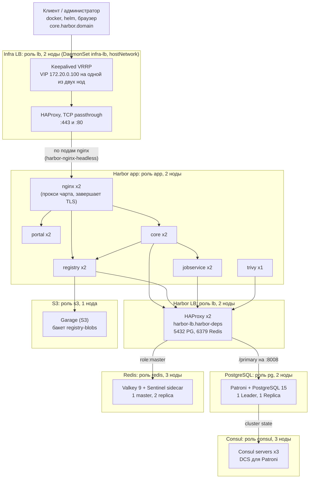

# Схема стенда: ноды, роли, адреса

Справочник по устройству лабораторного стенда Harbor active-active на KinD (прод-зеркало): какая нода за что отвечает, что на ней работает, по каким адресам компоненты видят друг друга и где лежат данные. Снимок состояния: 2026-09-25, стенд собран с нуля (P5): Harbor 2.14.3, PostgreSQL 15.19, Infra LB на Keepalived + HAProxy.

Что стабильно, а что нет:

| Стабильно (задано в репозитории) | Меняется при каждой пересборке кластера |
|----------------------------------|-----------------------------------------|
| имена нод и их роли (порядок в `hack/config/kind-cluster.yaml`) | IP-адреса нод (выдаёт Docker) |
| DNS-имена сервисов, порты, namespace | IP подов и ClusterIP сервисов |
| адрес Infra LB `172.20.0.100` (`Makefile` `LB_IP`, `virtual_ipaddress` в `hack/ha/infra-lb.yaml`), NodePort demo-приложения `30500` | какая `lb`-нода держит этот адрес, какой под роли стоит на какой ноде |
| подсети подов и сервисов | имена подов Deployment'ов (суффиксы) |

## Общая схема



Поток запроса `docker push`: клиент → `172.20.0.100` (VIP Keepalived) → HAProxy на ноде, держащей VIP (TCP, TLS не разбирает) → nginx Harbor (завершает TLS, сертификат из Secret `harbor-ha-ingress-tls`) → core (проверка токена) → registry → блобы в S3 (Garage); метаданные (проекты, артефакты, пользователи) — в PostgreSQL, кэш и очереди — в Redis. Harbor LB направляет соединения к БД на текущий primary Patroni, соединения к Redis — на текущий master.

Ingress-контроллера нет: Harbor отдаётся собственным nginx чарта (`expose.type: clusterIP`, решение D15 в `backlog.md`). Это значит, что nginx обращается к core, portal и registry через Service (ClusterIP), а не к подам напрямую: мёртвый под остаётся в endpoints Service, пока Kubernetes не признает ноду потерянной (≈ 52 с), и часть запросов в это окно зависает.

Бэкапы, Prometheus и Nexus с исходной схемы в лабораторию не входят (решения D8, D10 в `backlog.md`).

## Ноды

14 контейнеров Docker-сети `kind`: 1 control-plane и 13 воркеров. У каждого воркера метка и таинт `harbor-ha/role=<роль>` (`NoSchedule`): на роль попадают только поды с подходящим `nodeSelector` и toleration.

| Нода | Роль | IP (снимок) | Что на ней работает |
|------|------|-------------|---------------------|
| `harbor-control-plane` | control-plane (без роли) | 172.20.0.14 | Kubernetes API, etcd, coredns, local-path-provisioner; demo-приложение `hello` (NodePort 30500) |
| `harbor-worker` | `app` | 172.20.0.11 | по одной реплике nginx, core, portal, registry, jobservice |
| `harbor-worker2` | `app` | 172.20.0.5 | по одной реплике nginx, core, portal, registry, jobservice; `harbor-trivy-0` |
| `harbor-worker3` | `lb` | 172.20.0.12 | `infra-lb` (HAProxy + Keepalived), HAProxy (Harbor LB) |
| `harbor-worker4` | `lb` | 172.20.0.3 | `infra-lb` (HAProxy + Keepalived), HAProxy (Harbor LB) |
| `harbor-worker5` | `pg` | 172.20.0.2 | `pg-0` (Patroni + PostgreSQL) |
| `harbor-worker6` | `pg` | 172.20.0.15 | `pg-1` (Patroni + PostgreSQL) |
| `harbor-worker7` | `redis` | 172.20.0.8 | `redis-2` (Valkey + Sentinel) |
| `harbor-worker8` | `redis` | 172.20.0.13 | `redis-1` (Valkey + Sentinel) |
| `harbor-worker9` | `redis` | 172.20.0.6 | `redis-0` (Valkey + Sentinel) |
| `harbor-worker10` | `consul` | 172.20.0.10 | `consul-0` |
| `harbor-worker11` | `consul` | 172.20.0.9 | `consul-1` |
| `harbor-worker12` | `consul` | 172.20.0.4 | `consul-2` |
| `harbor-worker13` | `s3` | 172.20.0.7 | `garage-0` |

Колонка «Что на ней работает» — снимок: какой именно под (`pg-N`, `redis-N`, `consul-N`) на какой ноде оказался, зависит от порядка запуска; смотреть `kubectl get pods -A -o wide`. Правило постоянно: по одному поду роли на ноду, роль и нода соответствуют. Лидер PostgreSQL, master Redis и нода с VIP тоже могут быть на любой из своих нод: VIP находится командой `docker exec harbor-worker3 ip -4 addr show eth0 | grep 172.20.0.100` (и то же для `harbor-worker4`).

Актуальные IP нод: `kubectl get nodes -o wide` или `docker network inspect kind`.

Соответствие боевой схеме (по таблице узлов из прода): `app` = `hb-app-01/02`, `lb` = `hb-lb-01/02`, `pg` = `hb-pg-01/02`, `redis` = `hb-redis-01..03`; Consul и Garage (замена Ceph RGW) вынесены на собственные ноды по решению D1. Infra LB на Keepalived + HAProxy соответствует прод-схеме (D11).

## Сети и внешние адреса

| Что | Значение | Где задано |
|-----|----------|------------|
| Docker-сеть `kind` | `172.20.0.0/16`, шлюз `172.20.0.1` (хост) | Docker; проверять `docker network inspect kind` |
| Подсеть подов | `10.244.0.0/16` | kind (kubeadm `podSubnet`) |
| Подсеть сервисов | `10.96.0.0/16` | kind (kubeadm `serviceSubnet`) |
| Вход в Harbor (Infra LB), плавающий адрес | `172.20.0.100` -> `core.harbor.domain` | `Makefile` (`LB_IP`), `virtual_ipaddress` в `hack/ha/infra-lb.yaml`, `/etc/hosts` хоста и ноды |
| VRRP | multicast `224.0.0.18` на `eth0` нод `lb`, `virtual_router_id 51`, обе ноды `BACKUP` + `nopreempt` | `hack/ha/infra-lb.yaml` |
| Demo-приложение | `http://<IP control-plane>:30500` (NodePort `hello-service`, порт 5000 внутри) | `python-docker-hello-kube/deployment.yml` |
| Kubernetes API с хоста | `https://127.0.0.1:<порт>` (порт выдаётся при создании кластера) | `kubectl config` |

Имя `core.harbor.domain` должно резолвиться на хосте в `172.20.0.100` (`make add-host`), а Docker хоста — доверять реестру (`insecure-registries`). Если подсеть `kind` у вас другая, менять адреса нужно во всех связанных файлах сразу (README, «Load balancer IP»).

Порты на нодах `lb` (hostNetwork Infra LB): `:443` и `:80` (публичные, на всех адресах ноды), `127.0.0.1:8405` (health и статистика HAProxy, только с самой ноды: `docker exec <нода> curl -s http://127.0.0.1:8405/stats`).

## Сервисы внутри кластера

Все зависимости лежат в namespace `harbor-deps`; сам Harbor — в `default`. Пути ниже — DNS-имена, доступные из любого namespace (`<сервис>.<namespace>.svc.cluster.local`).

| Сервис | Адрес и порты | Кто ходит | Поды (роль ноды) |
|--------|---------------|-----------|------------------|
| Infra LB | `172.20.0.100`:80/443 (VIP на ноде роли `lb`); это не Service | клиенты | `infra-lb` x2 (`lb`, hostNetwork, DaemonSet) |
| Harbor nginx (вход) | `harbor.default`:80/443 -> под 8080/8443; поды по отдельности: `harbor-nginx-headless.default`:8080/8443 | Infra LB (по подам), внутрикластерные клиенты | `harbor-nginx` x2 (`app`) |
| Harbor core | `harbor-core.default`:80 | nginx, jobservice, registry | `harbor-core` x2 (`app`) |
| Harbor portal | `harbor-portal.default`:80 | nginx | `harbor-portal` x2 (`app`) |
| Harbor registry | `harbor-registry.default`:5000, 8080 | nginx, core | `harbor-registry` x2 (`app`) |
| Harbor jobservice | `harbor-jobservice.default`:80 | core | `harbor-jobservice` x2 (`app`) |
| Harbor trivy | `harbor-trivy.default`:8080 | core, jobservice | `harbor-trivy-0` (`app`) |
| Harbor LB: PostgreSQL | `harbor-lb.harbor-deps`:5432 | core, jobservice, registry | `harbor-lb` x2 (`lb`) -> текущий primary Patroni |
| Harbor LB: Redis | `harbor-lb.harbor-deps`:6379 | core, jobservice, registry, trivy | `harbor-lb` x2 (`lb`) -> текущий master |
| Harbor LB: статистика | `harbor-lb.harbor-deps`:8404 (`/stats`, `/healthz`) | оператор | `harbor-lb` x2 (`lb`) |
| PostgreSQL / Patroni | `pg-{0,1}.pg-headless.harbor-deps`:5432 (БД), :8008 (REST Patroni) | HAProxy, Patroni | `pg-0`, `pg-1` (`pg`) |
| Redis / Valkey | `redis-{0,1,2}.redis-headless.harbor-deps`:6379 | HAProxy, Sentinel | `redis-0..2` (`redis`) |
| Redis Sentinel | `redis-{0,1,2}.redis-headless.harbor-deps`:26379, мастер-сет `mymaster`, кворум 2 | Valkey, оператор | sidecar в тех же подах |
| Consul | `consul.harbor-deps`:8500 (клиентский), `consul-headless` :8300/8301/8600 | Patroni | `consul-0..2` (`consul`) |
| Garage (S3) | `s3.harbor-deps`:3900 (S3 API; RPC :3901 и admin :3903 наружу не открыты) | registry | `garage-0` (`s3`) |

Что и куда подключается в конфигурации Harbor (`hack/config/harbor-ha.yaml`): БД `registry`, пользователь `harbor`, хост `harbor-lb.harbor-deps.svc.cluster.local:5432`; Redis `harbor-lb.harbor-deps.svc.cluster.local:6379`, режим `redis` (не sentinel); S3 `http://s3.harbor-deps.svc.cluster.local:3900`, бакет `registry-blobs`, регион `us-east-1`.

Логика HAProxy Harbor LB (`hack/ha/haproxy.yaml`):

| Порт | Проверка здоровья бэкенда | Кто получает трафик |
|------|---------------------------|---------------------|
| 5432 | HTTP `GET /primary` на Patroni REST :8008, ожидается 200 | только текущий лидер PostgreSQL |
| 6379 | `AUTH` -> `PING` -> `INFO replication`, ожидается `role:master` и подключённая реплика | только текущий master Redis |

Логика HAProxy Infra LB (`hack/ha/infra-lb.yaml`, TCP passthrough):

| Порт | Проверка здоровья бэкенда | Кто получает трафик |
|------|---------------------------|---------------------|
| 443 | TCP-соединение + TLS-handshake к поду nginx :8443 (`check-ssl`); **не** HTTP-запрос через nginx | оба nginx по кругу; бэкенды (до 4 слотов `server-template`) берутся из DNS headless Service `harbor-nginx-headless` |
| 80 | TCP-соединение к поду nginx :8080 | те же поды; nginx отвечает редиректом на https |

Проверка сознательно не идёт через nginx к core: пока в Service числится мёртвый под core, такой запрос зависает и на исправном nginx, и HAProxy выключал бы оба nginx (найдено в `h44`).

Keepalived (`hack/ha/infra-lb.yaml`): VRRP на `eth0`, адрес `172.20.0.100/16`, приоритет 100, `nopreempt` (адрес не возвращается на вернувшуюся ноду), скрипт проверки — `GET http://127.0.0.1:8405/healthz` локального HAProxy раз в 2 с, при двух неудачах адрес отдаётся.

## Данные и состояние

Тома создаёт `local-path-provisioner` (StorageClass `standard`, ReadWriteOnce): данные лежат на диске той ноды-контейнера, где запущен под, и пропадают вместе с кластером.

| Данные | Где | Размер | Заметка |
|--------|-----|--------|---------|
| Блобы образов и чартов | Garage, бакет `registry-blobs`, PVC `data-garage-0` | 10 ГБ | не в томе registry: у registry PVC нет |
| Метаданные Harbor | PostgreSQL 15, БД `registry`, PVC `data-pg-0/1` | 5 ГБ на под | асинхронная репликация |
| Кэш, очереди, сессии | Valkey, PVC `data-redis-0..2` | 1 ГБ на под | `appendonly yes`; индексы БД Harbor: 0 core, 1 jobservice, 2 registry, 5 trivy |
| Состояние кластера Patroni | Consul, PVC `data-consul-0..2` | 1 ГБ на под | ключи `service/harbor-pg/*` |
| Кэш базы уязвимостей Trivy | PVC `data-harbor-trivy-0` | 5 ГБ | единственный PVC самого Harbor |
| Логи задач jobservice | в БД (`jobLoggers: [database]`) | | общего тома нет |

## Учётные данные и секреты

Пароли не хранятся в репозитории: генерируются `openssl rand` при первом запуске соответствующей команды и лежат в Secret'ах кластера.

| Secret | Namespace | Что внутри | Создаётся |
|--------|-----------|------------|-----------|
| `pg-credentials` | `harbor-deps` | пароли `superuser`, `replication`, `harbor` (роль БД Harbor) | `make postgres` |
| `redis-credentials` | `harbor-deps` | пароль Redis | `make redis` |
| `s3-credentials` | `harbor-deps` | секрет RPC и токен admin Garage; ключ доступа Harbor (`harbor-access-key` вида `GK…`, `harbor-secret-key`), права только на бакет `registry-blobs` | `make s3` |
| `harbor-ha-secrets` | `default` | пароль БД и Redis для Harbor, `secret`, `CSRF_KEY`, `JOBSERVICE_SECRET`, `REGISTRY_HTTP_SECRET`, `secretKey` | `make harbor-ha` |
| `harbor-ha-s3` | `default` | S3-ключи для registry | `make harbor-ha` |
| `harbor-ha-ingress-tls` | `default` | CA (`ca.crt`) и сертификат для `core.harbor.domain` (`tls.crt`, `tls.key`), 10 лет; используется nginx Harbor (имя осталось от схемы с ingress); CA стабилен между `helm upgrade` | `make harbor-ha` |
| `harbor-ha-token` | `default` | пара ключей подписи токенов (PKCS#1), общая для реплик core | `make harbor-ha` |
| `harbor` | `default` | pull secret для demo-приложения | `make deploy-app` |

Администратор Harbor: `admin` / `Harbor12345` (лабораторное значение по умолчанию, `harborAdminPassword` в chart). Как прочитать пароль из Secret и как сбросить компонент — в README, раздел «Build the stand».

## Образы, которые собираются локально

Два образа собираются на хосте и загружаются `kind load` только в ноды своей роли (`imagePullPolicy: Never`); они исчезают вместе с кластером:

| Образ | Собирается | Куда загружается |
|-------|------------|------------------|
| `harbor-ha/patroni:4.1.5-pg15.19` | `make pg-image` (входит в `make postgres`), `hack/ha/patroni/` | ноды `pg` |
| `harbor-ha/keepalived:2.3.4-alpine3.24` | `make keepalived-image` (входит в `make infra-lb`), `hack/ha/keepalived/` | ноды `lb` |

## Версии

Каждый компонент закреплён по версии (образы ещё и по digest): полная таблица в `backlog.md` («Закреплённые версии») и в README («Pinned versions»).

## Как быстро проверить, что схема соответствует действительности

```bash
kubectl get nodes -o custom-columns=NAME:.metadata.name,ROLE:'.metadata.labels.harbor-ha\/role',IP:.status.addresses[0].address
kubectl get pods -A -o wide          # какой под на какой ноде
kubectl get svc -A                   # адреса сервисов (LoadBalancer-сервисов нет, вход — VIP Keepalived)
```

Полная процедура проверки состояния и размещения — `docs/verification-runbook.md`.
